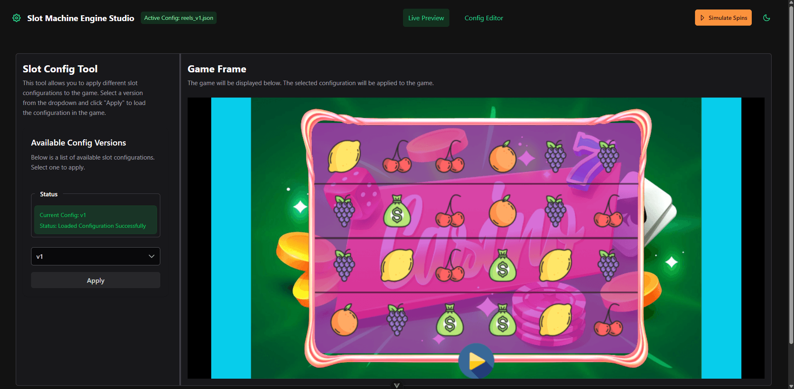
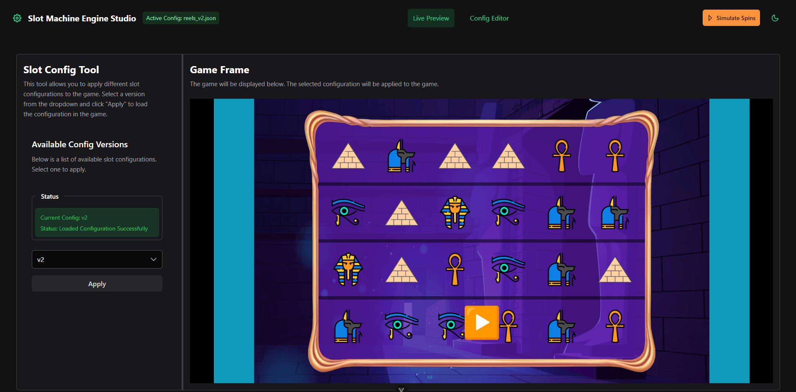
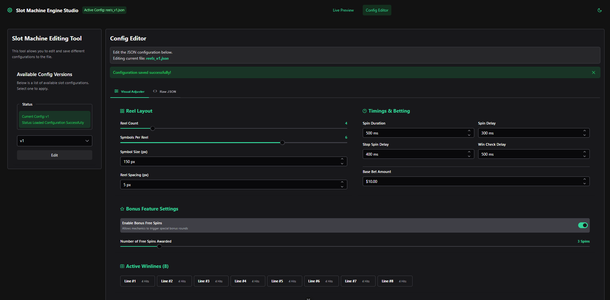
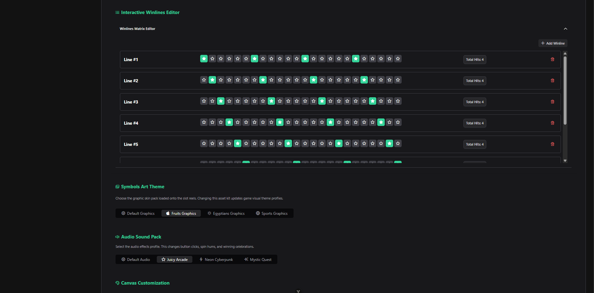
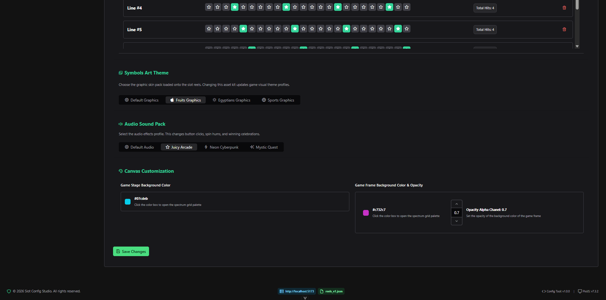
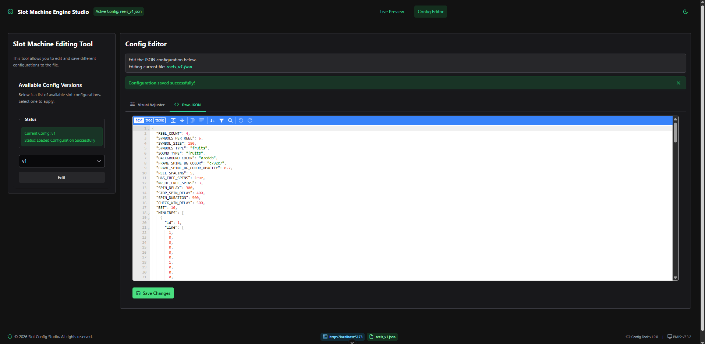
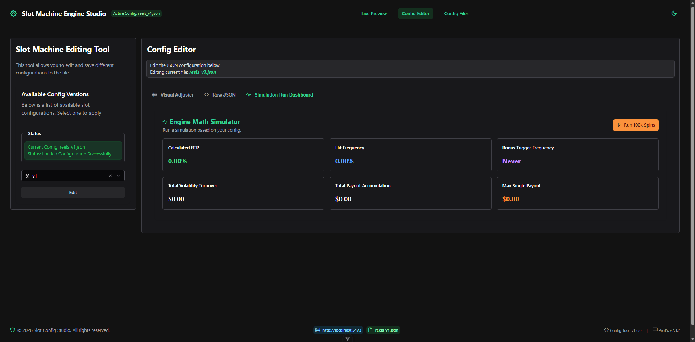
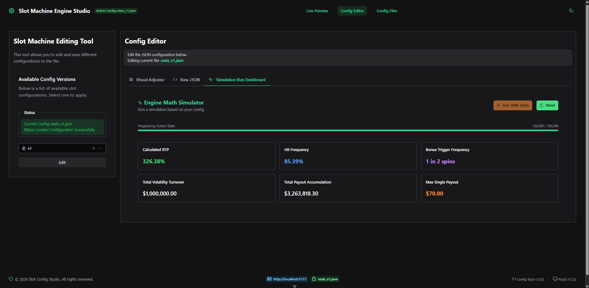
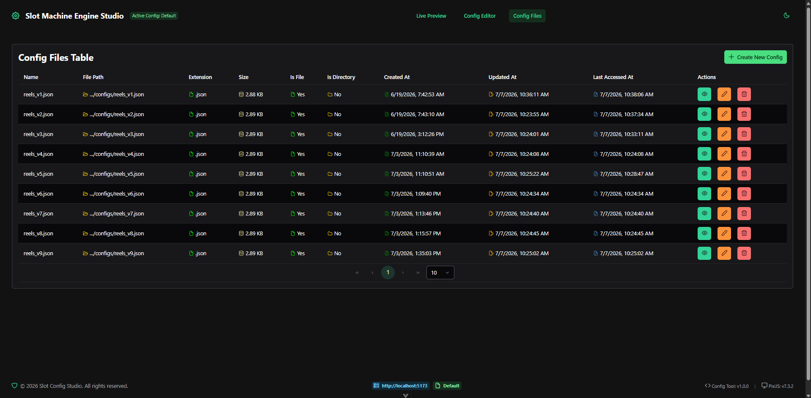
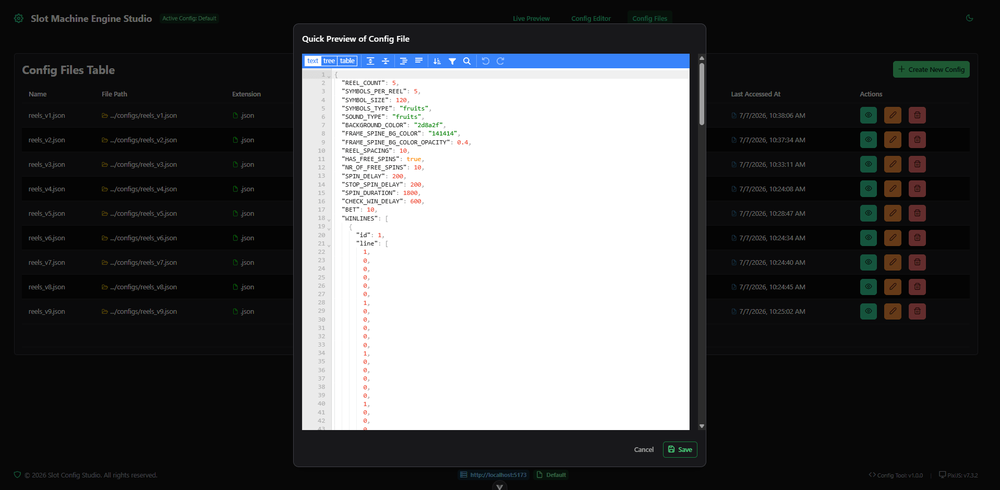

# Slot Game Configuration Tool

A powerful, full-stack development tool designed for live-editing and hot-reloading slot game configurations. This tool provides a real-time bridge between a Vue 3 management dashboard and a Pixi.js game running inside an iframe, utilizing WebSockets (Socket.io) and the HTML5 `postMessage` API for seamless hot-reloads.

---

## 🚀 Core Features

* **Live JSON Editor:** Formatted schema editing directly in the browser via `json-editor-vue`.
* **File Persistence:** Read and save modified JSON payloads directly back to your backend file system.
* **Instant Hot-Reload:** Inject live configuration changes into the active Pixi.js slot game instance without refreshing the page or losing canvas context.
* **Decoupled Architecture:** Clean sandboxing using an `iframe` ensuring your game environment remains separated from the editing control panel.
* **Enterprise Configuration Management (CRUD)** Full lifecycle management platform with a seamless CRUD workflow.
* **Live Simulation Dashboard (100k+ Spins):** Users can now run a live simulation of over 100,000 spins directly from the dashboard, getting real-time feedback on hit frequencies, RTP trends, and volatility performance before pushing a config to production.

---

## 🛠️ System Architecture & Data Flow

The system splits responsibilities across three decoupled runtimes. Communication flows sequentially through standard HTTP requests, HTML5 cross-domain messaging, and real-time WebSockets:

### 1. Control Layer (Vue 3 Frontend Dashboard)
* **Responsibility:** Manages configuration profiles, drives the UI selection inputs, and provisions data modifications inside a browser-based JSON workspace.
* **Outbound Pipeline:** Fires `postMessage` data dispatches across frames directly to the embedded child `iframe` document.

### 2. Execution Layer (Pixi.js Game Framework)
* **Responsibility:** Listens inside an encapsulated sandbox container, validates window origin signatures, and re-initializes engine layouts upon update events.
* **Outbound Pipeline:** Proxies engine state updates directly to the backend through open persistent Socket.io server channels.

### 3. Storage Layer (Node.js/Express Backend Server)
* **Responsibility:** Exposes REST endpoints for configuration version tracking, provides physical disk read/write mutations, and hosts the centralized live WebSocket hub.

---

## 🔄 Communication Flow & Lifecycle

Understanding how data traverses through the microservices during runtime:

* **Select & Load:** The user selects a version string (e.g., v1) on the Frontend. The frontend fetches the corresponding text from the backend API to render it in the editor.

* **Apply Trigger:** Clicking "Apply" fires a cross-origin workflow dispatch to the iframe target window:

```bash
window.postMessage({ type: 'LOAD_CONFIG', version: 'v1' }, '*')
```

* **Iframe Handshake:** The embedded game catches the window notification, validates the origin security check, and emits a socket message (request-config) back to the Node server.

* **Hot Replacement:** The backend returns the full object layout. The Pixi application receives it, flushes its active graphical display layout, and invokes init() dynamically without dropping the active browser canvas container loop.

---

## 🛡️ Security Best Practices

Because this tool utilizes cross-domain communication via postMessage, always ensure your production variables restrict wildcard parameters (*):

* Origin Whitelisting: The Game runtime strictly enforces domain tracking rules:

```bash
if (event.origin !== 'http://localhost:5173') return; // Blocks untrusted scripts
```

---

## 📦 Installation & Setup

Follow these steps to spin up the local development environment. Ensure you have [Node.js](https://nodejs.org/) installed (v18+ recommended).

### 1. Backend Server Setup
The backend handles the file system operations (reading and writing your `.json` configuration files) and serves as the Socket.io server.
```bash
cd backend
npm install
npm run dev
```

Default URL: http://localhost:3000

### 2. Frontend Control Panel Setup
The frontend is a Vue 3 dashboard integrated with PrimeVue components, providing the version manager and the live text/JSON editor workspace.

```bash
cd frontend
npm install
npm run dev
```

Default URL: http://localhost:5173

### 3. Game Simulation Setup
The game folder houses the Pixi.js engine build running independently, ready to embed inside the dashboard viewport.

```bash
cd game
npm install
npm start
```
Default URL: http://localhost:9000

## Screenshots










